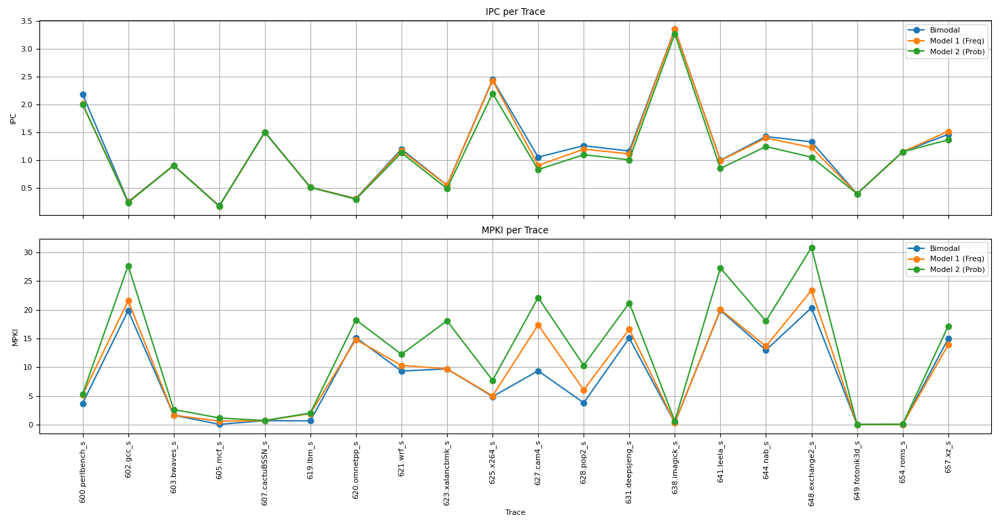

# Markov Predictor vs Saturating Counters

## Модели:
1. Bimodal — базовый предсказатель ChampSim.
2. Model 1 — Markov Predictor на основе частот (выбор самого частого направления).
3. Model 2 — Markov Predictor на основе вероятностей (частота_1 / (частота_1 + частота_2)).

## Метрики
1. IPC (Instructions Per Cycle) — чем выше, тем лучше.
2. MPKI (Misses Per Kilo Instructions) — чем ниже, тем лучше.

## Общие результаты (GMEAN)
| Модель	| IPC	| MPKI  |
|-----------|-------|-------|
| Bimodal	| 0.923	| 2.334 |
| Model 1	| 0.901	| 3.079 |
| Model 2	| 0.849	| 4.403 |

### Более подробные результаты из  [final_table.txt](final_table.txt)
| Trace               | IPC_bimodal | MPKI_bimodal  | IPC_model_1 | MPKI_model_1  | IPC_model_2  | MPKI_model_2  | 
|---------------------|-------------|---------------|-------------|---------------|--------------|---------------|
| 600.perlbench_s     |     2.186   |     3.673     |    2.011    |    5.179      |     2.002    |    5.287      |    
| 602.gcc_s           |     0.249   |     19.850    |    0.243    |    21.560     |     0.234    |    27.690     |    
| 603.bwaves_s        |     0.904   |     1.636     |    0.904    |    1.636      |     0.901    |    2.621      |    
| 605.mcf_s           |     0.174   |     0.044     |    0.170    |    0.594      |     0.167    |    1.154      |    
| 607.cactuBSSN_s     |     1.502   |     0.676     |    1.500    |    0.682      |     1.501    |    0.705      |    
| 619.lbm_s           |     0.508   |     0.650     |    0.507    |    1.914      |     0.507    |    2.012      |    
| 620.omnetpp_s       |     0.307   |     15.150    |    0.303    |    14.810     |     0.293    |    18.240     |    
| 621.wrf_s           |     1.195   |     9.320     |    1.170    |    10.310     |     1.129    |    12.240     |    
| 623.xalancbmk_s     |     0.545   |     9.704     |    0.544    |    9.704      |     0.485    |    18.070     |    
| 625.x264_s          |     2.446   |     4.877     |    2.432    |    5.002      |     2.198    |    7.704      |    
| 627.cam4_s          |     1.052   |     9.360     |    0.902    |    17.370     |     0.827    |    22.130     |    
| 628.pop2_s          |     1.257   |     3.790     |    1.195    |    6.032      |     1.095    |    10.320     |    
| 631.deepsjeng_s     |     1.161   |     15.070    |    1.111    |    16.610     |     1.003    |    21.190     |    
| 638.imagick_s       |     3.353   |     0.313     |    3.353    |    0.317      |     3.272    |    0.625      |    
| 641.leela_s         |     0.994   |     19.910    |    0.989    |    20.040     |     0.847    |    27.280     |    
| 644.nab_s           |     1.422   |     12.970    |    1.395    |    13.650     |     1.242    |    18.030     |    
| 648.exchange2_s     |     1.327   |     20.350    |    1.226    |    23.370     |     1.051    |    30.840     |    
| 649.fotonik3d_s     |     0.391   |     0.004     |    0.391    |    0.004      |     0.392    |    0.009      |    
| 654.roms_s          |     1.146   |     0.026     |    1.145    |    0.026      |     1.147    |    0.052      |    
| 657.xz_s            |     1.461   |     14.940    |    1.516    |    13.880     |     1.362    |    17.160     | 

## График

## Выводы
* Обе модели уступают Bimodal по IPC и MPKI.
* Model 2 показывает худшие результаты, особенно по MPKI, что говорит о наибольшем количестве ошибочных предсказаний.

### Конкретнее по моделям:
1. Model 1 (частоты): поведение ближе к Bimodal. 
В некоторых трассах показывает небольшое улучшение, например:
* 657.xz_s: увеличение IPC с 1.461 до 1.516 и снижение MPKI.

Однако на многих трассах заметно ухудшает MPKI, например:
* 627.cam4_s: MPKI вырос с 9.360 до 17.370.
* 602.gcc_s: рост MPKI с 19.85 до 21.56.

2. Model 2 (вероятности): почти всегда хуже, чем Model 1.
Очень высокое MPKI в трассах:
* 648.exchange2_s: 30.84 против 20.35 у Bimodal.
* 641.leela_s: 27.28 против 19.91 у Bimodal.

IPC также падает практически во всех трассах.

## Анализ

* Обе модели показали хуже производительность, чем базовый bimodal-предсказатель. Это может быть связано с тем, что Markov-предсказатели обладают высокой инерцией: при смене характера исполняемой программы они медленнее адаптируются к новым условиям, поскольку не имеют встроенных ограничений на значения счётчиков и сохраняют устаревшую информацию дольше.

* Сравнение между двумя Markov-подходами показывает, что модель, основанная на частотах переходов, работает стабильнее и точнее, чем модель, использующая вероятностный подход.

* Одной из причин может быть сложность предсказания циклических ветвлений при вероятностной стратегии. Например, в цикле с фиксированным числом итераций $N$, частотный подход делает ошибку только один раз за весь цикл. В то время как вероятностный предсказатель может делать до двух ошибок, особенно если вероятности переходов распределены равномерно, что ухудшает его точность.

* Также стоит отметить поведение моделей в ситуациях, когда нет накопленной статистики:
1. Частотная модель склонна предсказывать наиболее вероятный вариант (например, «переход будет»).
2. Вероятностная модель может выдавать неопределённый результат с равной вероятностью для «переход» и «не переход», что повышает количество ошибок.
