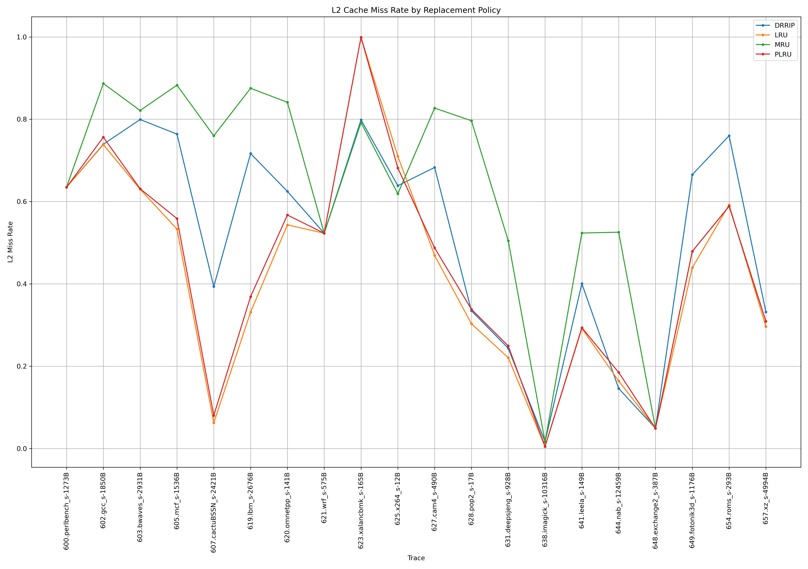

# Исследование политик замещения в кэш-памяти L2

## Цель задания

Провести сравнительный анализ различных политик замещения в кэш-памяти второго уровня (**L2 Cache**) при использовании симулятора **ChampSim**, и определить, какая из них показывает наилучшие характеристики по **промахам кэша (miss rate)** на различных трассах.

## Описание эКсПеРиМеНтАлЬнОй установки

- **Тип кэша**: L2 Cache
- **Политики замещения**:
  - **LRU (Least Recently Used)** — вытесняет самый давно используемый блок. Уже реализованная политика в ChampSim.
  - **MRU (Most Recently Used)** — вытесняет наиболее недавно использованный блок. Самостоятельно реализованная политика.
  - **PLRU (Pseudo-LRU)** — аппроксимация LRU с меньшими затратами. Самостоятельно реализованная политика.
  - **DRRIP (Dynamic Re-reference Interval Prediction)** — адаптивная политика, выбирающая между вытеснением новых и старых блоков на основе вероятностей повторного обращения. Уже реализованная политика в ChampSim.

## Ожидания

| Политика  | Теоретическое поведение                                                                  |
|-----------|------------------------------------------------------------------------------------------|
| **LRU**   | Должно быть чуть лучше PLRU по ожиланиям.                                                |
| **MRU**   | Должно работать **хуже**, чем все остальное, если данные часто переиспользуются.         |
| **PLRU**  | Повторяет поведение LRU, но может давать немного худшие результаты из-за приближённости. |
| **DRRIP** | Предназначена для адаптации к разным типам нагрузок. Должно быть лучшей политикой.       |

## Фактические результаты

Для каждой из 20 трасс получены значения **L2 Miss Rate** при использовании всех четырёх политик.
Полные данные из [final_table.txt](final_table.txt)

|                     Trace  |  MISS_RATE_DRRIP  |  MISS_RATE_LRU   |   MISS_RATE_MRU  |  MISS_RATE_PLRU  |
|----------------------------|-------------------|------------------|------------------|------------------| 
| 600.perlbench_s-1273B.txt  |         0.6349    |       0.6347     |      0.6351      |      0.6347      |
|       602.gcc_s-1850B.txt  |         0.7393    |       0.7383     |      0.8869      |      0.7564      |
|    603.bwaves_s-2931B.txt  |         0.7993    |       0.6299     |      0.8213      |      0.6311      |
|       605.mcf_s-1536B.txt  |         0.7639    |       0.5331     |      0.8829      |      0.5586      |
| 607.cactuBSSN_s-2421B.txt  |         0.3933    |       0.0623     |      0.7598      |      0.0802      |
|       619.lbm_s-2676B.txt  |         0.7167    |       0.3313     |      0.8753      |      0.3689      |
|    620.omnetpp_s-141B.txt  |         0.6248    |       0.5434     |      0.8412      |      0.5673      |
|        621.wrf_s-575B.txt  |         0.5230    |       0.5230     |      0.5230      |      0.5230      |
|  623.xalancbmk_s-165B.txt  |         0.7985    |       0.9993     |      0.7920      |      0.9993      |
|        625.x264_s-12B.txt  |         0.6386    |       0.7101     |      0.6189      |      0.6817      |
|       627.cam4_s-490B.txt  |         0.6829    |       0.4691     |      0.8271      |      0.4874      |
|        628.pop2_s-17B.txt  |         0.3346    |       0.3032     |      0.7964      |      0.3383      |
|  631.deepsjeng_s-928B.txt  |         0.2436    |       0.2206     |      0.5049      |      0.2493      |
|  638.imagick_s-10316B.txt  |         0.0167    |       0.0044     |      0.0159      |      0.0050      |
|      641.leela_s-149B.txt  |         0.4006    |       0.2917     |      0.5235      |      0.2936      |
|      644.nab_s-12459B.txt  |         0.1459    |       0.1642     |      0.5256      |      0.1849      |
|  648.exchange2_s-387B.txt  |         0.0491    |       0.0491     |      0.0491      |      0.0491      |
| 649.fotonik3d_s-1176B.txt  |         0.6655    |       0.4391     |      0.4790      |      0.4790      |
|       654.roms_s-293B.txt  |         0.7600    |       0.5920     |      0.5887      |      0.5887      |
|        657.xz_s-4994B.txt  |         0.3317    |       0.2963     |      0.3091      |      0.3091      |

### График по этой таблице:

### Среднее геометрическое значение (GMEAN) промахов по всем трассам:

| Политика         | GMEAN Miss Rate  |
|------------------|------------------|
| **LRU**          | 0.2889           |
| **MRU**          | 0.4765           |
| **PLRU**         | 0.3049           |
| **DRRIP**        | 0.3881           |

## Анализ результатов

- **LRU** показала ожидаемо хорошие результаты, хотя на одном из бенчмарков, а именно - 623.xalancbmk_s-165B, 
результаты оказались хуже, чем даже MRU и подозрительный DRRIP (о чем позже)
- **PLRU** дала **почти идентичные результаты с LRU**, что подтверждает её эффективность как лёгкой реализации LRU. 
Разница с LRU вышла действительно небольшая - 2% по GMEAN, что соответствует ожиданиям. В LRU всегда самая последняя
ячейка вытесняется, чего нельзя сказать про PLRU. В PLRU нет гарантии того, что часто используемые ячейки 
не будут вытеснены. Аналогично замечена аномалия вместе с LRU для бенчмарка 623.xalancbmk_s-165B.
- **MRU** оказалась ожидаемо **худшей** по среднему значению. Количество промахов составило 
почти половину всех случаев, что соответствует особенностям реализации.
- **DRRIP**, несмотря на адаптивность, **уступила LRU и PLRU**, что может быть связано с тем, что трассы содержат преимущественно однотипные паттерны доступа, и DRRIP не успевает или неправильно адаптируется. Либо же реализация в
самом симуляторе не лучшая.
- на трассе 621.wrf_s-575B и 648.exchange2_s-387B все политики замещения дали одинаковый результат по cache miss.
Возможные причины такого поведения - либо идеально кэшируются, либо полностью вытесняются без повторов.
